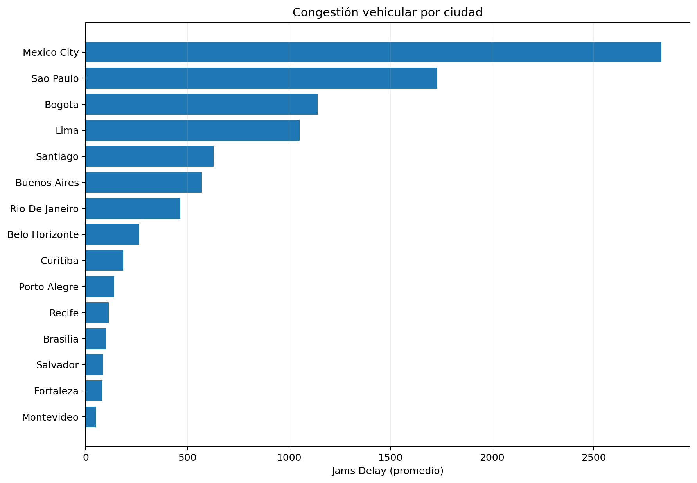
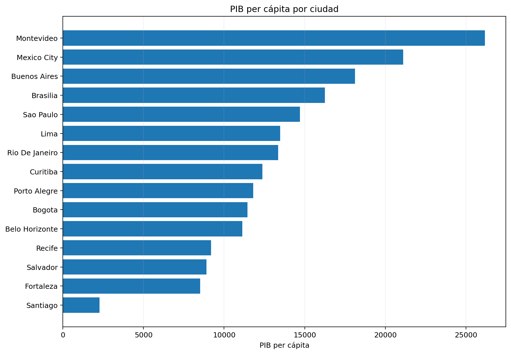
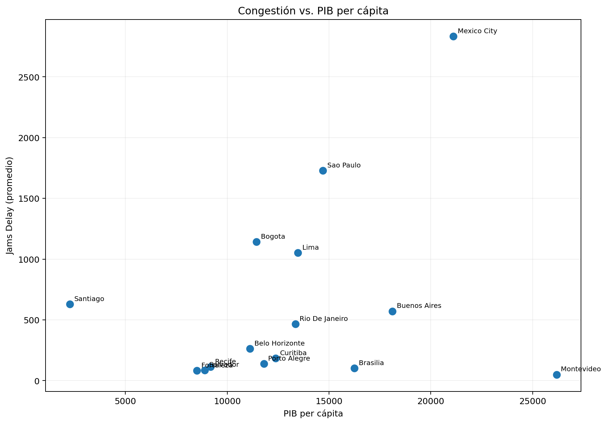

# Movilidad Urbana y Economía en América Latina

## Resumen ejecutivo del proyecto

**Objetivo:** evaluar cómo la congestión vehicular se relaciona con la productividad económica en 15 ciudades latinoamericanas y transformar los resultados en una recomendación de priorización para inversión en infraestructura de transporte.

> Este README presenta los principales resultados, visualizaciones e insights de negocio.  
> El análisis completo, la limpieza, transformación y código reproducible se encuentran en [`S5 ladb_mobility_economy_project_student_versionGithub.ipynb`](./S5%20ladb_mobility_economy_project_student_versionGithub.ipynb).

---

## Tabla de contenido

- [Tecnologías utilizadas](#tecnologías-utilizadas)
- [Fuentes de datos](#fuentes-de-datos)
- [Paso 1: Calidad y preparación de datos](#paso-1-calidad-y-preparación-de-datos)
- [Paso 2: Congestión vehicular por ciudad](#paso-2-congestión-vehicular-por-ciudad)
- [Paso 3: PIB per cápita y productividad económica](#paso-3-pib-per-cápita-y-productividad-económica)
- [Paso 4: Relación entre congestión y economía](#paso-4-relación-entre-congestión-y-economía)
- [Paso 5: Priorización de inversión](#paso-5-priorización-de-inversión)
- [Conclusión y recomendaciones](#conclusión-y-recomendaciones)
- [Reproducibilidad y dataset TomTom](#reproducibilidad-y-dataset-tomtom)

---

## Tecnologías utilizadas

`Python` · `Jupyter Notebook` · `pandas` · `NumPy` · `Matplotlib` · `Seaborn`

**Técnicas aplicadas:** limpieza y transformación de datos, estandarización de nombres y tipos, integración de fuentes, agregación por ciudad, análisis exploratorio (EDA), ranking de indicadores, análisis de correlación de Pearson y visualización comparativa.

[↑ Volver al inicio](#movilidad-urbana-y-economía-en-américa-latina)

---

## Fuentes de datos

| Fuente | Contenido | Uso |
|---|---|---|
| `tomtom_traffic.csv` | Métricas de tráfico y congestión por ciudad: `jams_delay`, `traffic_index_live`, longitud y número de embotellamientos, tiempos de viaje y retrasos | Fuente principal de movilidad |
| `oecd_city_economy.csv` | PIB per cápita, desempleo, PM2.5 y población | Contexto económico y urbano |
| `datasets/ladb_mobility_economy_2024_clean.csv` | Dataset consolidado y limpio de 15 ciudades | Dataset final para análisis |

> **Nota sobre TomTom:** el archivo original `tomtom_traffic.csv` supera los 100 MB y no se incluye directamente en el repositorio por el límite de tamaño de GitHub. El dataset consolidado utilizado para el análisis sí se encuentra disponible en `datasets/ladb_mobility_economy_2024_clean.csv`.

[↑ Volver al inicio](#movilidad-urbana-y-economía-en-américa-latina)

---

## Paso 1: Calidad y preparación de datos

**Pregunta de análisis:** ¿los datos de movilidad y economía tienen la calidad necesaria para compararlos?

El dataset de tráfico contenía más de **1 millón de registros**, por lo que antes de realizar cualquier comparación fue necesario preparar y homologar ambas fuentes.

Principales tareas realizadas:

- Revisión de estructura, tipos de datos y valores ausentes.
- Conversión de `UpdateTimeUTC` y `UpdateTimeUTCWeekAgo` a formato fecha.
- Conversión de variables económicas almacenadas como texto a valores numéricos.
- Estandarización de nombres de columnas a formato `snake_case`.
- Homologación de nombres de ciudades entre ambas fuentes.
- Filtrado y agregación de las métricas de tráfico al nivel de ciudad.
- Integración de información de movilidad y economía en una sola tabla analítica.
- Validación final de las 15 ciudades disponibles en ambas fuentes.

**Entregable:** [`datasets/ladb_mobility_economy_2024_clean.csv`](./datasets/ladb_mobility_economy_2024_clean.csv)

[↑ Volver al inicio](#movilidad-urbana-y-economía-en-américa-latina)

---

## Paso 2: Congestión vehicular por ciudad

**Pregunta de negocio:** ¿qué ciudades presentan la mayor presión de congestión?

| Posición | Ciudad | `jams_delay` promedio |
|---:|---|---:|
| 1 | Ciudad de México | 2,833.1 |
| 2 | São Paulo | 1,729.2 |
| 3 | Bogotá | 1,141.6 |
| 4 | Lima | 1,052.3 |
| 5 | Santiago | 629.9 |

Ciudad de México destaca claramente como la ciudad con mayor `jams_delay` del grupo, seguida por São Paulo. Bogotá y Lima también muestran niveles elevados, formando un segundo bloque de ciudades con fuerte presión sobre su movilidad.



**Insight:** la congestión está altamente concentrada en unas pocas grandes áreas metropolitanas. Esto permite priorizar el análisis sobre ciudades donde las pérdidas de tiempo y fricción de movilidad pueden tener una mayor escala operativa.

[↑ Volver al inicio](#movilidad-urbana-y-economía-en-américa-latina)

---

## Paso 3: PIB per cápita y productividad económica

**Pregunta de negocio:** ¿qué ciudades presentan mayor productividad económica por habitante?

| Posición | Ciudad | PIB per cápita | `jams_delay` |
|---:|---|---:|---:|
| 1 | Montevideo | 26,176 | 50.2 |
| 2 | Ciudad de México | 21,111 | 2,833.1 |
| 3 | Buenos Aires | 18,117 | 571.1 |
| 4 | Brasilia | 16,251 | 101.6 |
| 5 | São Paulo | 14,703 | 1,729.2 |

El contraste más llamativo aparece en **Montevideo**: registra el PIB per cápita más alto del conjunto y, al mismo tiempo, uno de los niveles de congestión más bajos.



**Insight:** una ciudad puede alcanzar un nivel económico alto sin presentar necesariamente una congestión elevada. Esto cuestiona la idea de utilizar el tráfico como proxy directo de actividad o productividad económica.

[↑ Volver al inicio](#movilidad-urbana-y-economía-en-américa-latina)

---

## Paso 4: Relación entre congestión y economía

**Pregunta de negocio:** ¿una mayor congestión implica una mayor productividad económica?

Al comparar `jams_delay` con PIB per cápita, la correlación de Pearson obtenida es aproximadamente:

**r = 0.283**

La relación es **positiva pero débil**. Es decir, dentro de esta muestra no existe evidencia de que las ciudades con mayor congestión sean sistemáticamente las de mayor PIB per cápita.



Ejemplos que ilustran esta relación:

- **Ciudad de México:** congestión extremadamente alta y PIB per cápita alto.
- **Montevideo:** congestión muy baja y el mayor PIB per cápita de la muestra.
- **Bogotá y Lima:** congestión elevada con PIB per cápita intermedio.
- **Brasilia:** congestión relativamente baja con uno de los PIB per cápita más altos.

**Insight de negocio:** la congestión no debe interpretarse de manera aislada como señal de fortaleza económica. Una estrategia de infraestructura necesita combinar presión de movilidad, relevancia económica, tamaño urbano y capacidad de generar impacto.

[↑ Volver al inicio](#movilidad-urbana-y-economía-en-américa-latina)

---

## Paso 5: Priorización de inversión

**Pregunta de negocio:** ¿en qué ciudades podría generar mayor impacto una inversión orientada a mejorar la movilidad?

### Ciudades prioritarias: Bogotá y Lima

Ambas ciudades presentan una combinación especialmente relevante:

| Ciudad | `jams_delay` | PIB per cápita | Población |
|---|---:|---:|---:|
| Bogotá | 1,141.6 | 11,442 | 11.3 M |
| Lima | 1,052.3 | 13,472 | 11.2 M |

La recomendación no parte únicamente de identificar dónde existe más tráfico. El criterio combina:

**Congestión elevada + escala poblacional + actividad económica relevante = mayor oportunidad potencial de impacto.**

Ciudad de México y São Paulo también presentan una presión de movilidad superior, pero Bogotá y Lima constituyen casos especialmente interesantes para estudiar una intervención donde una mejora en infraestructura pueda reducir una fricción importante en ciudades de más de 11 millones de habitantes.

> La priorización representa una conclusión exploratoria y no una evaluación financiera completa de proyectos de infraestructura.

[↑ Volver al inicio](#movilidad-urbana-y-economía-en-américa-latina)

---

## Conclusión y recomendaciones

### Diagnóstico general

El análisis muestra que **congestión y productividad económica no son equivalentes**. La correlación entre `jams_delay` y PIB per cápita es débil (`r ≈ 0.283`), y existen contrastes importantes entre ciudades.

Ciudad de México concentra la mayor congestión del grupo, mientras Montevideo registra el mayor PIB per cápita con una presión de tráfico muy baja. Estos casos muestran por qué las decisiones de infraestructura no deberían apoyarse en una sola métrica.

### Recomendaciones priorizadas

1. **Priorizar análisis de factibilidad en Bogotá y Lima**, donde coinciden congestión elevada, grandes poblaciones y actividad económica relevante.
2. **No utilizar congestión como proxy de productividad económica**; combinar indicadores de movilidad con variables económicas y demográficas.
3. **Ampliar el modelo de priorización** incorporando costos de infraestructura, densidad poblacional, uso del transporte público, pérdidas de horas-hombre y crecimiento económico.
4. **Incorporar series de tiempo** para distinguir problemas estructurales de episodios temporales de congestión.
5. **Evaluar impacto antes y después de las intervenciones** mediante KPIs de movilidad para medir si la inversión produce mejoras reales.

### Consideraciones

Este proyecto es un análisis exploratorio basado en una muestra de **15 ciudades** y un corte temporal consolidado. La correlación observada describe asociación, no causalidad. Para convertir la priorización en una decisión de inversión sería necesario incorporar costos, viabilidad técnica, políticas públicas, evolución temporal y variables adicionales de transporte.

[↑ Volver al inicio](#movilidad-urbana-y-economía-en-américa-latina)

---

## Reproducibilidad y dataset TomTom

El archivo original de TomTom supera el límite estándar de **100 MB por archivo de GitHub**.

Opciones recomendadas para publicarlo:

- **Git LFS:** adecuado si quieres mantener el dataset vinculado directamente al repositorio.
- **Kaggle Dataset:** buena opción para un portafolio de Data Analytics porque permite documentar, versionar y compartir datos.
- **Google Drive / OneDrive:** funcional para descarga, aunque menos reproducible como proyecto público.

Para este repositorio, una opción limpia es conservar el dataset procesado dentro de GitHub y publicar el archivo crudo de TomTom externamente.

Estructura sugerida:

```text
Movilidad-Urbana-y-Economia/
│
├── assets/
│   ├── congestion_ciudades.png
│   ├── congestion_vs_pib.png
│   └── pib_per_capita_ciudades.png
│
├── datasets/
│   ├── ladb_mobility_economy_2024_clean.csv
│   ├── oecd_city_economy.csv
│   └── Diccionario.xlsx
│
├── S5 ladb_mobility_economy_project_student_versionGithub.ipynb
└── README.md
```

---

## Competencias demostradas

`Data Cleaning` · `Data Wrangling` · `EDA` · `Pandas` · `Data Visualization` · `Pearson Correlation` · `Business Analysis` · `Data Storytelling` · `Decision Support`

---

### Autor

**Pedro David Reyes Pérez**  
Proyecto de análisis de datos enfocado en transformar información urbana y económica en criterios de decisión.
