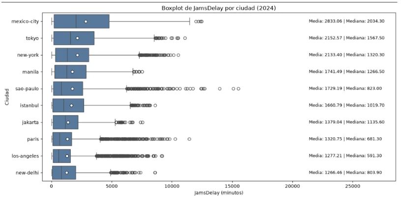
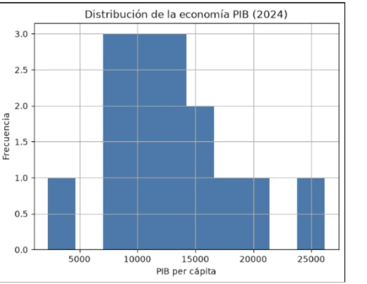
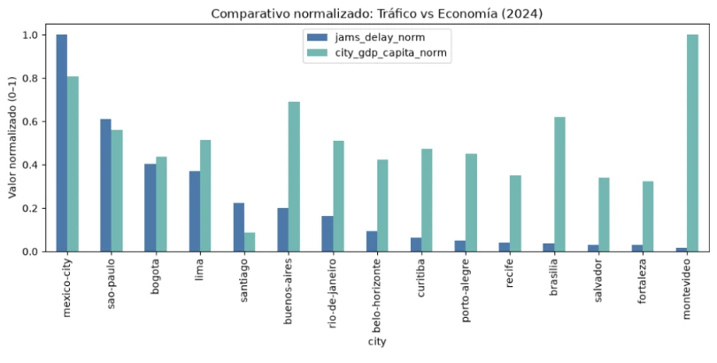

# Movilidad Urbana y Economía en América Latina

## Resumen ejecutivo del proyecto

**Objetivo:** analizar la relación entre congestión vehicular y productividad económica para identificar patrones urbanos y apoyar la priorización de inversiones en infraestructura de transporte.

El proyecto integra información de tráfico de **TomTom** con indicadores económicos por ciudad, realizando limpieza, transformación, análisis exploratorio y comparación de métricas mediante **Python**.

> Este README resume los principales hallazgos y visualizaciones del proyecto.  
> El desarrollo completo y el código reproducible se encuentran en [`S5 ladb_mobility_economy_project_student_versionGithub.ipynb`](./S5%20ladb_mobility_economy_project_student_versionGithub.ipynb).

---

## Tecnologías utilizadas

`Python` · `Jupyter Notebook` · `pandas` · `NumPy` · `Matplotlib` · `Seaborn`

**Técnicas aplicadas:** limpieza y transformación de datos, integración de fuentes, análisis exploratorio, estadística descriptiva, normalización de variables y visualización comparativa.

---

## Fuentes de datos

| Fuente | Contenido | Uso |
|---|---|---|
| `tomtom_traffic` | Métricas de tráfico y congestión por ciudad | Análisis de movilidad |
| `oecd_city_economy.csv` | Indicadores económicos y urbanos | Contexto económico |
| `datasets/ladb_mobility_economy_2024_clean.csv` | Dataset consolidado y preparado | Análisis comparativo final |

> **Nota:** el archivo original `tomtom_traffic` supera los 100 MB y no se incluye directamente en el repositorio por el límite estándar de GitHub. El dataset limpio y consolidado sí puede mantenerse dentro del proyecto.

---

## Paso 1: Calidad y preparación de datos

Antes del análisis se realizaron tareas de:

- revisión de estructura y tipos;
- identificación de valores ausentes;
- homologación de nombres de ciudades;
- normalización de nombres de columnas;
- agregación de registros de tráfico a nivel ciudad;
- integración de movilidad y economía;
- construcción del dataset limpio de 2024.

**Dataset resultante:** [`datasets/ladb_mobility_economy_2024_clean.csv`](./datasets/ladb_mobility_economy_2024_clean.csv)

---

## Paso 2: Análisis de congestión vehicular

### Pregunta de análisis

**¿Qué ciudades presentan mayores niveles de retraso por embotellamientos y qué tan variable es ese comportamiento?**

Para analizar `JamsDelay` se utilizó un **boxplot por ciudad**, que permite observar media, mediana, dispersión y valores atípicos.



### Hallazgos principales

| Ciudad | Media JamsDelay | Mediana JamsDelay |
|---|---:|---:|
| Mexico City | 2,833.06 | 2,034.30 |
| Tokyo | 2,152.57 | 1,567.50 |
| New York | 2,133.40 | 1,320.30 |
| Manila | 1,741.49 | 1,266.50 |
| São Paulo | 1,729.19 | 823.00 |

**Mexico City** presenta la media y mediana más altas del grupo mostrado.

El gráfico también evidencia numerosos **valores atípicos**, especialmente en ciudades como São Paulo, Paris, New York y Los Angeles. La diferencia entre media y mediana en varias ciudades sugiere distribuciones sesgadas hacia valores altos debido a episodios de congestión extrema.

> **Insight:** la congestión no debe evaluarse únicamente con un promedio; la mediana, la dispersión y los eventos extremos ayudan a entender mejor la presión real sobre la movilidad.

---

## Paso 3: Distribución de la economía

### Pregunta de análisis

**¿Cómo se distribuye el PIB per cápita entre las ciudades latinoamericanas del análisis?**



La mayor concentración de ciudades se ubica aproximadamente entre **8,000 y 15,000** de PIB per cápita, aunque existen valores claramente más bajos y otros superiores a **20,000–25,000**.

> **Insight:** las ciudades analizadas presentan realidades económicas heterogéneas, por lo que comparar directamente valores absolutos de tráfico y PIB puede ser engañoso.

---

## Paso 4: Tráfico vs Economía

### Pregunta de negocio

**¿Las ciudades con mayor congestión son también las ciudades con mayor PIB per cápita?**

Como `JamsDelay` y PIB per cápita utilizan escalas distintas, ambas variables se normalizaron entre **0 y 1**:

```python
merged_norm["jams_delay_norm"] = (
    merged_norm["jams_delay"] / merged_norm["jams_delay"].max()
)

merged_norm["city_gdp_capita_norm"] = (
    merged_norm["city_gdp_capita"] / merged_norm["city_gdp_capita"].max()
)
```

Posteriormente, las ciudades se ordenaron de mayor a menor congestión.



### Lo que revela el gráfico

- **Mexico City** combina el mayor nivel relativo de congestión con un PIB per cápita alto.
- **São Paulo** también presenta niveles altos en ambas dimensiones.
- **Montevideo** muestra el PIB per cápita relativo más alto, pero uno de los niveles más bajos de congestión.
- **Brasilia** presenta un PIB per cápita relativamente alto con una congestión reducida.
- **Bogotá** muestra valores relativamente cercanos entre ambas variables.

> **Insight principal:** **una mayor congestión no implica automáticamente una mayor productividad económica.**

El tráfico también depende de infraestructura, transporte público, densidad, diseño urbano, patrones de movilidad y capacidad vial.

---

## Paso 5: Interpretación para negocio

Una decisión de inversión en infraestructura no debería priorizar ciudades únicamente por tener más tráfico.

Conviene combinar:

**Presión de movilidad + importancia económica + escala urbana**

Esto convierte el análisis en una herramienta inicial de **screening** para identificar ciudades que justifican un estudio de factibilidad más profundo.

---

## Conclusiones

1. **La congestión está muy concentrada:** Mexico City destaca por sus elevados niveles de `JamsDelay`.
2. **Los promedios no cuentan toda la historia:** los boxplots muestran dispersión, sesgo y numerosos valores extremos.
3. **Existe una amplia heterogeneidad económica:** el PIB per cápita varía considerablemente entre ciudades.
4. **Congestión y economía no son equivalentes:** el comparativo normalizado muestra ciudades económicamente fuertes con baja congestión.
5. **Las decisiones de infraestructura deben ser multidimensionales:** sería recomendable incorporar población, densidad, transporte público, horas perdidas, costos del tráfico, crecimiento económico y costo de las intervenciones.

> **Conclusión:** los datos de movilidad adquieren mayor valor cuando se analizan dentro de su contexto económico. Integrar ambas dimensiones permite pasar de describir el tráfico a formular preguntas útiles para la toma de decisiones.

---

## Reproducibilidad y dataset TomTom

El dataset original `tomtom_traffic` supera el límite estándar de **100 MB por archivo de GitHub**.

### Opción recomendada: Kaggle Dataset

Publicarlo en Kaggle permitiría mantener ligero el repositorio y ofrecer una fuente pública, documentada y descargable.

Posteriormente puedes añadir:

```markdown
### Dataset original

[Descargar dataset TomTom en Kaggle](URL_DEL_DATASET)
```

Otras alternativas son **Git LFS, Google Drive o OneDrive**.

---

## Estructura sugerida

```text
Movilidad-Urbana-y-Economia/
│
├── assets/
│   ├── boxplot_jamsdelay_ciudad.webp
│   ├── distribucion_pib_2024.webp
│   └── trafico_vs_economia_normalizado.webp
│
├── datasets/
│   └── ladb_mobility_economy_2024_clean.csv
│
├── S5 ladb_mobility_economy_project_student_versionGithub.ipynb
└── README.md
```

---

## Competencias demostradas

`Python` · `Pandas` · `Data Cleaning` · `Data Wrangling` · `EDA` · `Data Visualization` · `Estadística descriptiva` · `Normalización` · `Business Analysis` · `Data Storytelling` · `Decision Support`

---

## Autor

**Pedro David Reyes Pérez**

Proyecto de análisis de datos enfocado en transformar información urbana y económica en insights útiles para la toma de decisiones.

